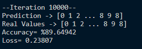
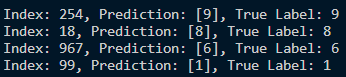
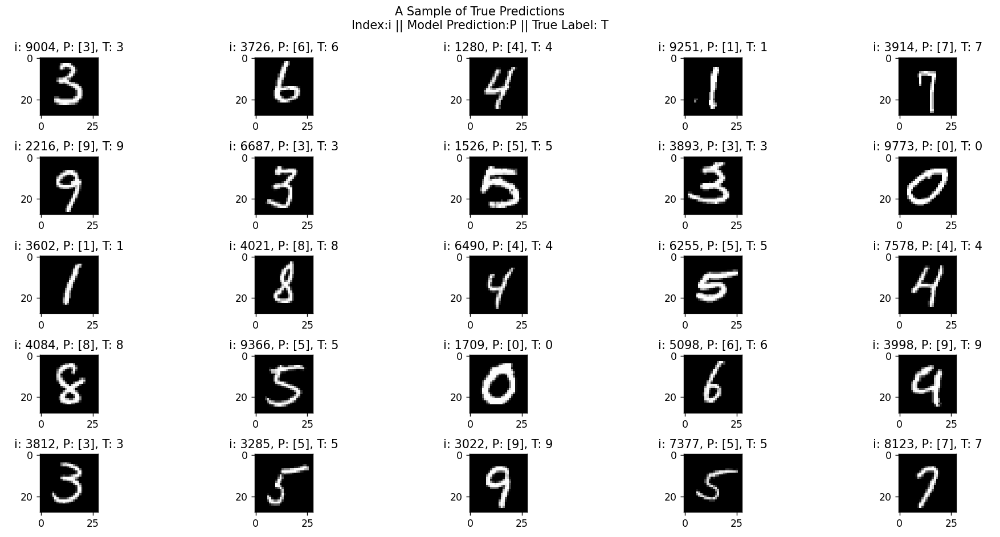
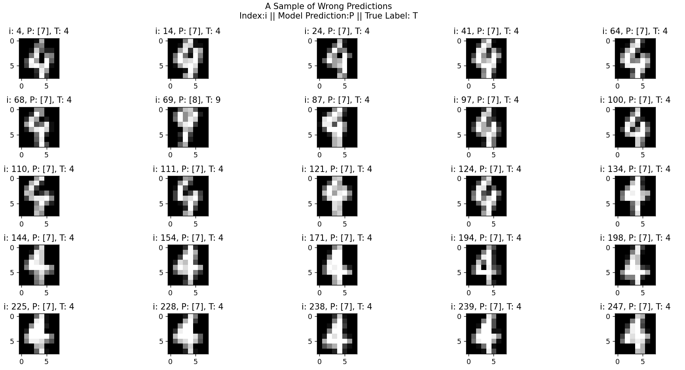

# NEURAL NETWORK with DIGITS DATASET
&nbsp;

## DATASET
- Images are **(28, 28)** pixels
- MNIST dataset has **60000** image but we use **10000** of them for training

&nbsp;
## 3 LAYER NEURAL NETWORK v1
- 1st layer -> 20 neurons, **RELU** activation function
- 2nd layer -> 15 neurons, **RELU** activation function
- 3rd layer -> 10 neurons, **SOFTMAX** activation function
- All layers **fully connected**
- Iteration amount: **10000**
- Learning Rate: **0.01**
- There is no optimizer, initializer just vanilla neural network with **Z Score Normalization**
- Lack of the optimizer provides **unstability** on model performance
- Lack of the initializer provides **not learning** model
- Accuracy around **%75 - %85** in general

&nbsp;
&nbsp;
**Last Iteration of One Model**

&nbsp;
&nbsp;
**Testing Some Sample with Random Indices**

&nbsp;
&nbsp;
**A True Labeled Sample from Model Predictions**

&nbsp;
&nbsp;
**A Wrong Labeled Sample from Model Predictions**

