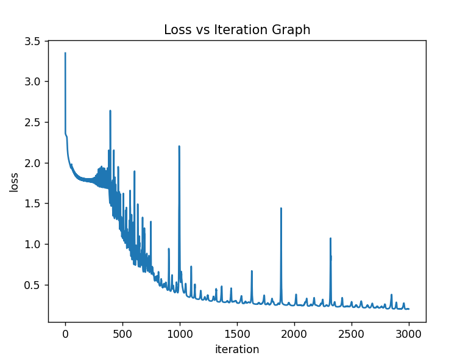
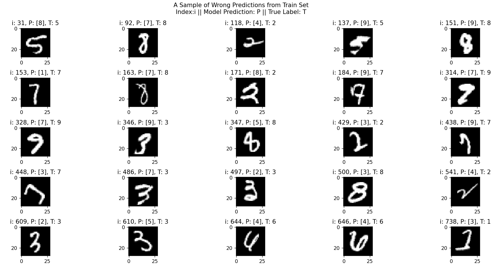

# NEURAL NETWORK with DIGITS DATASET
&nbsp;

## DATASET
- Images are **(28, 28)** pixels
- MNIST dataset has **60000** training, **10000** test images

&nbsp;
## 3 LAYER NEURAL NETWORK v1
- 1st layer -> 20 neurons, **RELU** activation function
- 2nd layer -> 15 neurons, **RELU** activation function
- 3rd layer -> 10 neurons, **SOFTMAX** activation function
- All layers **fully connected**
- Training Image Amount: **10000**
- Iteration amount: **10000**
- Learning Rate: **0.01**
- There is no optimizer and initializer, just vanilla neural network with **Z Score Normalization**
- Lack of the optimizer provides **unstability** on model performance
- Lack of the initializer provides **not learning** model
- Accuracy around **%75 - %85** in general

&nbsp;
**Last Iteration of One Model**

&nbsp;
**Testing Some Sample with Random Indices**

&nbsp;
**A True Labeled Sample from Model Predictions**

&nbsp;
**A Wrong Labeled Sample from Model Predictions**

&nbsp;
## 3 LAYER NEURAL NETWORK v2
- 1st layer -> 20 neurons, **RELU** activation function
- 2nd layer -> 15 neurons, **RELU** activation function
- 3rd layer -> 10 neurons, **SOFTMAX** activation function
- All layers **fully connected**
- Training Image Amount: **15000**, more than these causes slow computation
- Test Image Amount: **2500**
- Iteration amount: **3000**
- Learning Rate = **0.01**
- There is **He Initializer** for RELU, **Xavier Initializer** for SOFTMAX activation functions
- There is **L2 Regularization** for prevent overfitting
- Regularization parameter **Lambda = 0.05**
- Still there is no optimizer so, **unstable** gradient descending shows up
- Training set accuracy around **%90+** in general
- Test set accuracy between **%89 - %92** in general
#### *Differences between v1 and v2*
- Because of the initializers the accuracy is **so rapidly** increasing
- Because of the L2 regularization **overfitting is decreasing** and test set **accuracy is increasing**
- No need for lots of iterations anymore, **2000 - 3000 iterations** enough for this model to learn

&nbsp;
**Last Iteration of One Model**

&nbsp;
**Test Set Accuracy**

&nbsp;
**A True Labeled Sample from Train Set**

&nbsp;
**A Wrong Labeled Sample from Train Set**

&nbsp;
**A Wrong Labeled Sample from Test Set**

&nbsp;
**Loss Graph**

&nbsp;
**Model Prediction Probabilities of Wrong Labeled Images in Test Set**

&nbsp;
## 3 LAYER NEURAL NETWORK v3
- 1st layer -> 20 neurons, **RELU** activation function
- 2nd layer -> 15 neurons, **RELU** activation function
- 3rd layer -> 10 neurons, **SOFTMAX** activation function
- All layers **fully connected**
- Training Image Amount: Dataset limit **60000**, you are free to choose how much do you want, no more slow computation
- Test Image Amount: Dataset limit **10000**
- Iteration amount: **300-400 epochs** in general
- Learning Rate = **0.01**
- There is **He Initializer** for RELU, **Xavier Initializer** for SOFTMAX activation functions
- There is **L2 Regularization** for prevent overfitting
- Regularization parameter **Lambda = 0.05**
- There is **Mini-Batching** for optimization
- Another optimization algorithm is **Gradient Momentum**
- Gradient Momentum parameter **Beta = 0.9**
- Training set accuracy around **%95+** in general
- Test set accuracy between **%93 - %97** in general
#### *Differences between v2 and v3*
- Due to *Mini-Batching*, no more vibrations on loss graph. **Stable gradient descending** and **very fast computation**. Therefore, we can calculate **lots of data** with **less epochs**. (*1 Epoch: 1 complete iteration of computing forward and back props for all batches*)
- Due to *Gradient Momentum*, if the **difference high** then gradient **decreasing higher**, if **difference low** then gradient **decreasing lower**. Because of that **more accurate** and **faster** gradient descending providing.
- **Less iterations** (epochs) needed for learning and **more accurate** models.

&nbsp;
**Last Iteration of One Model**

&nbsp;
**Test Set Accuracy**

&nbsp;
**A Wrong Labeled Sample from Train Set**

&nbsp;
**A Wrong Labeled Sample from Test Set**

&nbsp;
**Loss Graph**

&nbsp;
**Model Prediction Probabilities of Wrong Labeled Images in Test Set (1)**

&nbsp;
**Model Prediction Probabilities of Wrong Labeled Images in Test Set (2)**

